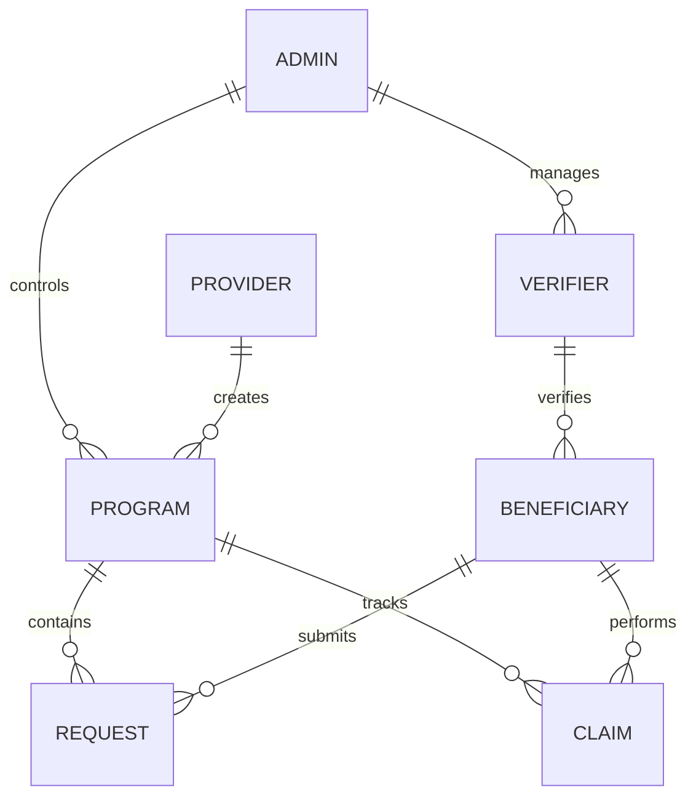
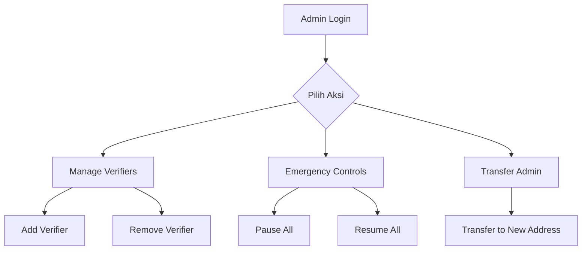
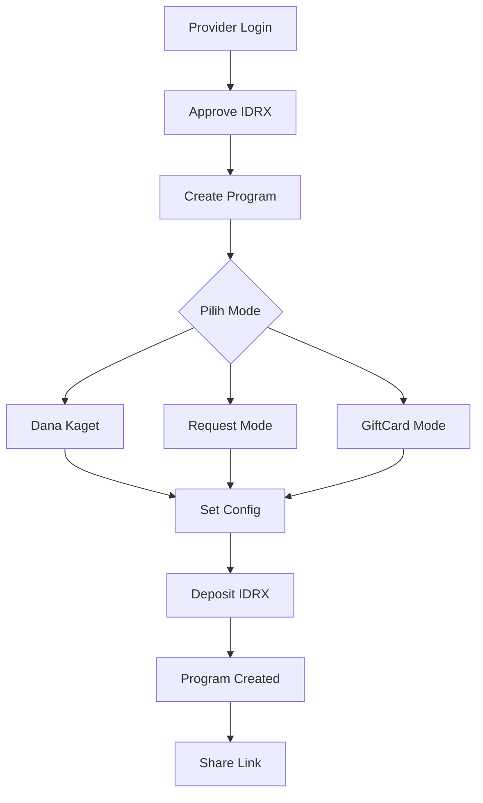
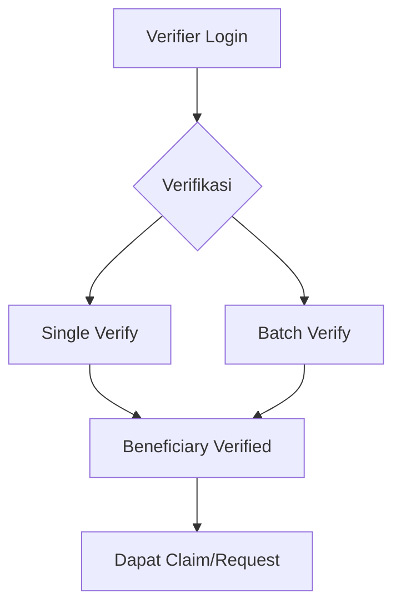
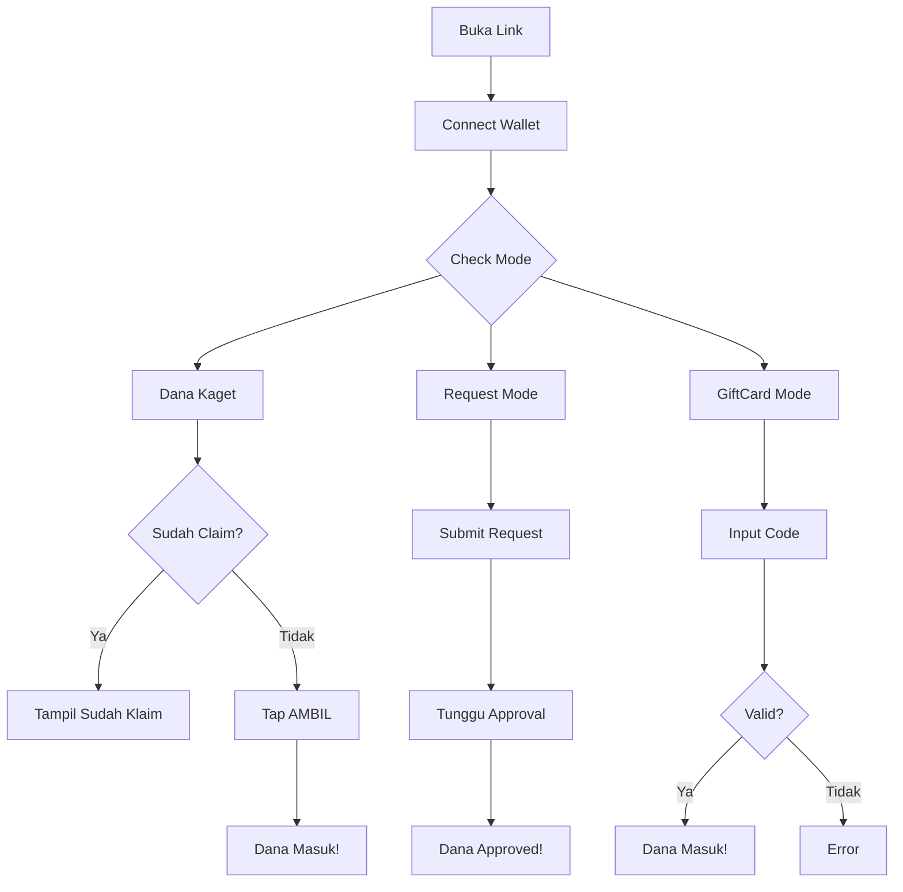
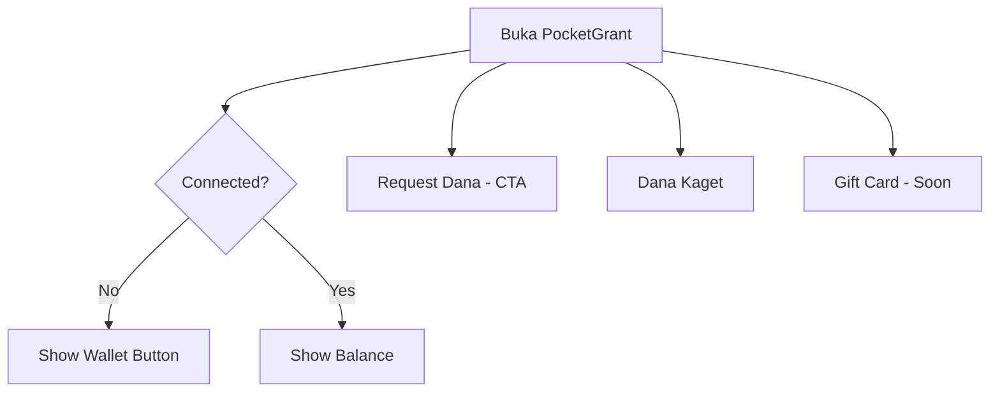
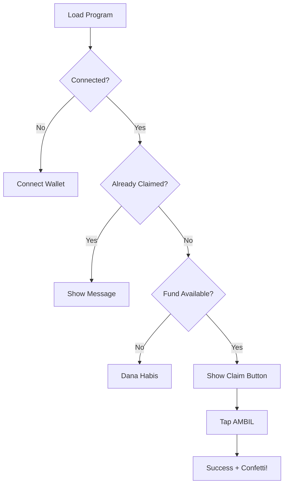
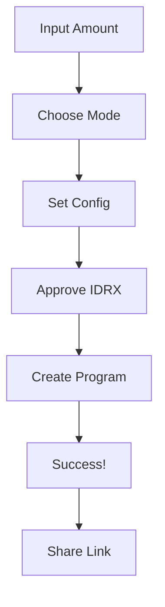
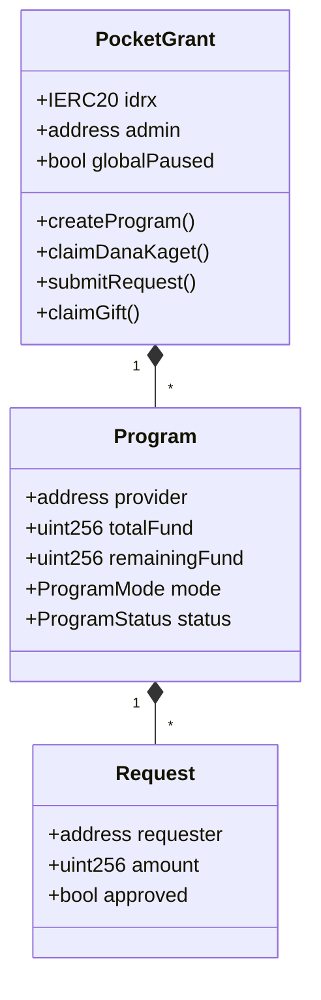

# PocketGrant - Walkthrough Aplikasi 💰

> **Smart Contract Engine for Educational Fund Distribution**
>
> "Satu klik, dana rupiah sampai — cepat, transparan, dan audit-ready."

---

## 📖 Overview Aplikasi

PocketGrant adalah platform distribusi dana pendidikan berbasis blockchain yang dibangun di atas **Base Network** menggunakan token **IDRX**. Aplikasi ini dirancang untuk pengalaman **mobile-first** dengan 3 mode distribusi:

| Mode              | Deskripsi                              | Use Case                      |
| ----------------- | -------------------------------------- | ----------------------------- |
| 🎉 **Dana Kaget** | One-tap claim, first-come-first-served | Viral campaign, hadiah massal |
| 📝 **Request**    | Submit request, provider approves      | Beasiswa terverifikasi        |
| 🎁 **GiftCard**   | Claim dengan secret code               | Share via QR/link privat      |

### ⚡ Aturan Claim per Mode

| Mode              | Aturan                             | Penjelasan                                           |
| ----------------- | ---------------------------------- | ---------------------------------------------------- |
| 🎉 **Dana Kaget** | **1x per program per wallet**      | Sekali klaim langsung, tidak bisa klaim ulang        |
| 📝 **Request**    | **Unlimited submissions**          | Bisa ajukan berkali-kali, tunggu approval provider   |
| 🎁 **GiftCard**   | **Unlimited attempts, butuh kode** | Bisa coba berkali-kali, butuh kode valid untuk klaim |

> 💡 **Catatan:** User dapat berpartisipasi di **program yang berbeda** dengan mode yang berbeda. Aturan di atas berlaku **per program**.

---

## 🏗️ Entity Relationship Diagram (ERD)

### 📋 Entity Details

| Entity          | Key Fields                                                               |
| --------------- | ------------------------------------------------------------------------ |
| **ADMIN**       | wallet, canPauseGlobal, canManageVerifiers                               |
| **VERIFIER**    | wallet, isActive, addedBy                                                |
| **PROVIDER**    | wallet                                                                   |
| **PROGRAM**     | programId, provider, totalFund, remainingFund, maxPerClaim, mode, status |
| **REQUEST**     | requestId, programId, requester, amount, approved, paid                  |
| **CLAIM**       | programId, claimant, amount, hasClaimed                                  |
| **BENEFICIARY** | wallet, programId, isVerified                                            |

---

## 📅 Role-Based Flows

### 1. 🔐 Admin Flow

Admin adalah super-user yang memiliki kontrol global atas sistem.

**Fungsi Admin:**
| Function | Description |
|----------|-------------|
| `transferAdmin(newAdmin)` | Transfer admin role ke address baru |
| `setVerifier(verifier, status)` | Tambah/hapus verifier |
| `setGlobalPause(paused)` | Pause/resume seluruh contract |

---

### 2. 💼 Provider Flow

Provider adalah penyedia dana yang membuat dan mengelola program distribusi.

**Program Management:**
| Function | Description |
|----------|-------------|
| `createProgram(config)` | Buat program baru + deposit dana |
| `topUpProgram(programId, amount)` | Tambah dana |
| `pauseProgram(programId)` | Pause sementara |
| `resumeProgram(programId)` | Resume program |
| `endProgram(programId)` | Akhiri permanent |
| `withdrawRemaining(programId)` | Tarik sisa dana |

---

### 3. ✅ Verifier Flow

Verifier bertanggung jawab memverifikasi beneficiary.

**Fungsi Verifier:**
| Function | Description |
|----------|-------------|
| `verifyBeneficiary(programId, beneficiary)` | Single verification |
| `verifyBeneficiaries(programId, beneficiaries[])` | Batch verification |

---

### 4. 🎓 Beneficiary Flow

Beneficiary adalah penerima dana.

**Fungsi Beneficiary:**
| Function | Description |
|----------|-------------|
| `claimDanaKaget(programId)` | One-tap claim |
| `submitRequest(programId, amount)` | Submit request |
| `claimGift(programId, code)` | Claim dengan code |

---

## 📱 Frontend Pages

### Home Page (`/`)

### Claim Flow (`/claim/:id`)

### Create Program (`/donate`)

---

## 🔧 Smart Contract

### Contract Structure

---

## 🔒 Security Features

| Feature                   | Implementation               |
| ------------------------- | ---------------------------- |
| **Reentrancy Protection** | `nonReentrant` modifier      |
| **Safe Transfers**        | OpenZeppelin `SafeERC20`     |
| **CEI Pattern**           | State update before calls    |
| **Access Control**        | `onlyProvider`, `onlyAdmin`  |
| **Time Locks**            | `start` dan `end` timestamps |
| **Global Pause**          | Emergency stop               |

---

## 🌐 Tech Stack

### Smart Contract

- **Language**: Solidity ^0.8.20
- **Framework**: Foundry
- **Token**: IDRX (ERC20)
- **Chain**: Base Sepolia / Base Mainnet

### Frontend

- **Framework**: Next.js 14
- **Styling**: Tailwind CSS
- **Web3**: Wagmi + Viem
- **Wallet**: Coinbase Smart Wallet
- **Animations**: Framer Motion

---

## 📄 Deployed Contracts

| Contract    | Address                                      | Chain        |
| ----------- | -------------------------------------------- | ------------ |
| PocketGrant | `0x486c001d1a07b15613ba57b9eeb5b1333a1383ef` | Base Sepolia |
| IDRX Token  | `0x7cca9d58715511d51c9d270a155df79c8f990586` | Base Sepolia |

---

## 🎬 Demo Flow

### Provider Demo

1. Connect Wallet dengan saldo IDRX
2. Buka `/donate` → Input dana
3. Pilih mode → Set config
4. Approve IDRX → Create program
5. Share link ke penerima

### User Demo

1. Buka link dari provider
2. Connect Smart Wallet
3. Tap "AMBIL DANA"
4. IDRX masuk instant!

---

> 💡 **Tip**: Untuk gasless, set `NEXT_PUBLIC_PAYMASTER_URL` di environment.
