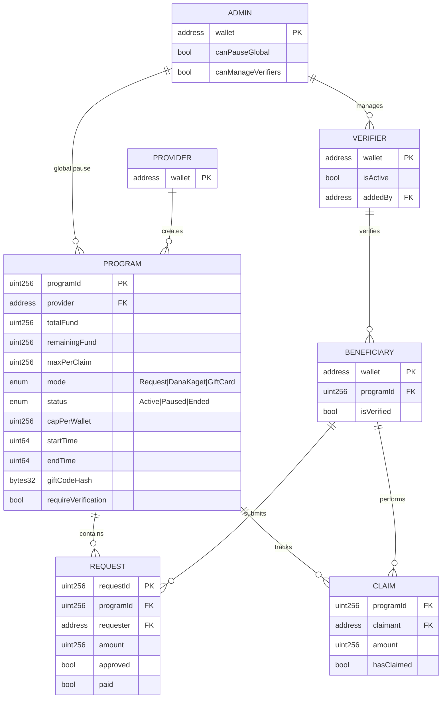
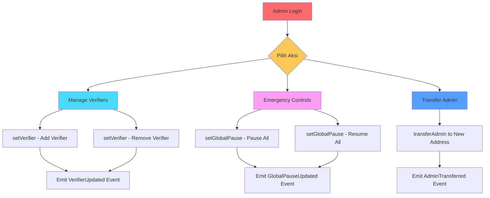
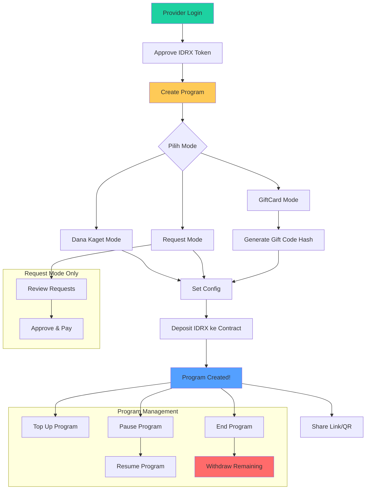
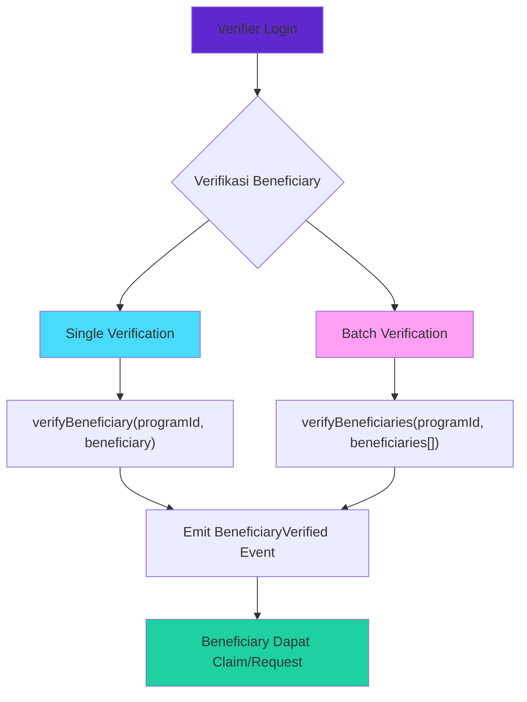
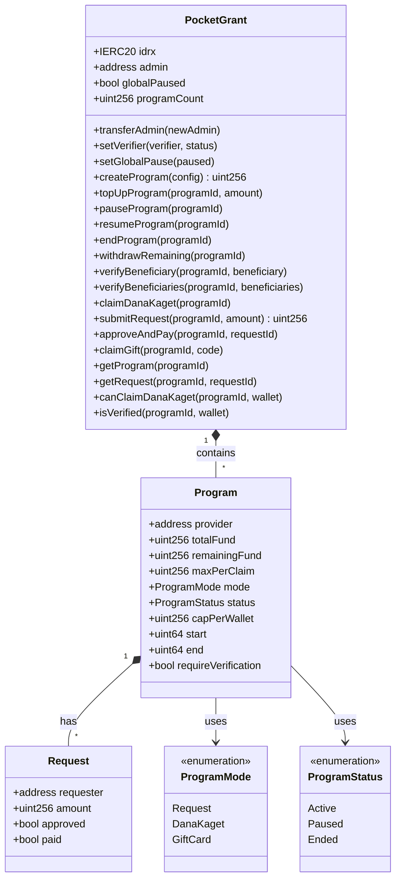

# PocketGrant - Walkthrough Aplikasi 💰

> **Smart Contract Engine for Educational Fund Distribution**
>
> "Satu klik, dana rupiah sampai — cepat, transparan, dan audit-ready."

---

## 📖 Overview Aplikasi

PocketGrant adalah platform distribusi dana pendidikan berbasis blockchain yang dibangun di atas **Base Network** menggunakan token **IDRX**. Aplikasi ini dirancang untuk pengalaman **mobile-first** dengan 3 mode distribusi:

| Mode              | Deskripsi                              | Use Case                      |
| ----------------- | -------------------------------------- | ----------------------------- |
| 🎉 **Dana Kaget** | One-tap claim, first-come-first-served | Viral campaign, hadiah massal |
| 📝 **Request**    | Submit request, provider approves      | Beasiswa terverifikasi        |
| 🎁 **GiftCard**   | Claim dengan secret code               | Share via QR/link privat      |

---

## 🏗️ Entity Relationship Diagram (ERD)



---

## 👥 Role-Based Flow Diagrams

### 1. 🔐 Admin Flow

Admin adalah super-user yang memiliki kontrol global atas sistem.



**Fungsi Admin:**
| Function | Description |
|----------|-------------|
| `transferAdmin(newAdmin)` | Transfer admin role ke address baru |
| `setVerifier(verifier, status)` | Tambah/hapus verifier |
| `setGlobalPause(paused)` | Pause/resume seluruh contract (emergency) |

---

### 2. 💼 Provider Flow

Provider adalah penyedia dana yang membuat dan mengelola program distribusi.



**Fungsi Provider:**
| Function | Description |
|----------|-------------|
| `createProgram(config)` | Buat program baru + deposit dana |
| `topUpProgram(programId, amount)` | Tambah dana ke program |
| `pauseProgram(programId)` | Pause program sementara |
| `resumeProgram(programId)` | Resume program yang di-pause |
| `endProgram(programId)` | Akhiri program permanent |
| `withdrawRemaining(programId)` | Tarik sisa dana (setelah ended) |
| `approveAndPay(programId, requestId)` | Approve dan bayar request |

---

### 3. ✅ Verifier Flow

Verifier bertanggung jawab memverifikasi beneficiary sebelum mereka bisa claim/request.



**Fungsi Verifier:**
| Function | Description |
|----------|-------------|
| `verifyBeneficiary(programId, beneficiary)` | Verifikasi single beneficiary |
| `verifyBeneficiaries(programId, beneficiaries[])` | Batch verifikasi |

---

### 4. 🎓 Beneficiary (User) Flow

Beneficiary adalah penerima dana yang melakukan claim atau submit request.

```mermaid
flowchart TD
    A[User Buka Link/QR] --> B[Connect Wallet]
    B --> C{Check Program Mode}

    C --> D[Dana Kaget Mode]
    D --> D1{Sudah Claim?}
    D1 -->|Ya| D2[Tampilkan "Sudah Klaim"]
    D1 -->|Tidak| D3{Dana Tersedia?}
    D3 -->|Ya| D4["Tap AMBIL DANA"]
    D3 -->|Tidak| D5[Tampilkan "Dana Habis"]
    D4 --> D6[claimDanaKaget]
    D6 --> D7[🎉 Dana Masuk Wallet!]

    C --> E[Request Mode]
    E --> E1{Perlu Verifikasi?}
    E1 -->|Ya| E2{Sudah Verified?}
    E2 -->|Tidak| E3[Tunggu Verifikasi]
    E2 -->|Ya| E4[Submit Request]
    E1 -->|Tidak| E4
    E4 --> E5[Tunggu Approval Provider]
    E5 --> E6[Dana Masuk saat Approved!]

    C --> F[GiftCard Mode]
    F --> F1{Perlu Verifikasi?}
    F1 -->|Ya| F2{Sudah Verified?}
    F2 -->|Tidak| F3[Tunggu Verifikasi]
    F2 -->|Ya| F4[Masukkan Gift Code]
    F1 -->|Tidak| F4
    F4 --> F5{Code Valid?}
    F5 -->|Ya| F6[claimGift]
    F5 -->|Tidak| F7[Invalid Code Error]
    F6 --> F8[🎁 Dana Masuk Wallet!]

    style A fill:#00d2d3
    style D7 fill:#1dd1a1
    style E6 fill:#1dd1a1
    style F8 fill:#1dd1a1
    style D2 fill:#feca57
    style D5 fill:#ff6b6b
```

**Fungsi Beneficiary:**
| Function | Description |
|----------|-------------|
| `claimDanaKaget(programId)` | One-tap claim (tanpa verifikasi) |
| `submitRequest(programId, amount)` | Submit request dana |
| `claimGift(programId, code)` | Claim dengan secret code |

---

## 📱 Frontend Application Flow

### Home Dashboard

```mermaid
flowchart LR
    A[Landing Page] --> B{Wallet Connected?}
    B -->|No| C[Show "Connect Wallet" Card]
    B -->|Yes| D[Show IDRX Balance]

    A --> E[Buat Dana Kaget Card]
    E --> F["/create" Page]

    A --> G[Gift Card Card]
    A --> H[Request Dana Card]
    A --> I[Program Stats Card]
    A --> J[Demo Link Card]
    J --> K["/claim/1" Page]
```

### Create Program Page

```mermaid
flowchart TD
    A["/create" Page] --> B{Wallet Connected?}
    B -->|No| C[Show Connect Wallet]
    B -->|Yes| D{Correct Chain?}
    D -->|No| E[Show Switch Network Button]
    D -->|Yes| F[Show Balance & Form]

    F --> G[Input Total Dana]
    G --> H[Input Per Claim Amount]
    H --> I{Needs Approval?}

    I -->|Yes| J[Click Approve IDRX]
    J --> K[Wait TX Confirmation]
    K --> F

    I -->|No| L[Click "Buat Dana Kaget"]
    L --> M[Wait TX Confirmation]
    M --> N[Success! Show Share Link]
    N --> O[Copy Link / View Claim Page]
```

### Claim Page

```mermaid
flowchart TD
    A["/claim/:id" Page] --> B[Load Program Data]
    B --> C{Loading?}
    C -->|Yes| D[Show Loader]
    C -->|No| E{Wallet Connected?}

    E -->|No| F[Show Connect Wallet]
    E -->|Yes| G{Already Claimed?}

    G -->|Yes| H[Show "Sudah Klaim" Message]
    G -->|No| I{Fund Available?}

    I -->|No| J[Show "Dana Habis" Message]
    I -->|Yes| K{Correct Chain?}

    K -->|No| L[Show Switch Network Button]
    K -->|Yes| M[Show Claim Button]

    M --> N[Click "AMBIL DANA SEKARANG"]
    N --> O{Paymaster Available?}
    O -->|Yes| P[Gasless Transaction]
    O -->|No| Q[Normal Transaction]

    P --> R[Wait Confirmation]
    Q --> R
    R --> S[🎉 Confetti + Success Message]
    S --> T[Show BaseScan Link]
```

---

## 🔧 Smart Contract Architecture

### Contract Structure



---

## 🔒 Security Features

| Feature                   | Implementation                                        |
| ------------------------- | ----------------------------------------------------- |
| **Reentrancy Protection** | `nonReentrant` modifier pada semua token transfers    |
| **Safe Transfers**        | OpenZeppelin `SafeERC20`                              |
| **CEI Pattern**           | State updated sebelum external calls                  |
| **Custom Errors**         | Gas-efficient error handling                          |
| **Access Control**        | `onlyProvider`, `onlyAdmin`, `onlyVerifier` modifiers |
| **Time Locks**            | `start` dan `end` timestamps untuk program            |
| **Global Pause**          | Emergency stop untuk seluruh contract                 |

---

## 🌐 Tech Stack

### Smart Contract

- **Language**: Solidity ^0.8.20
- **Framework**: Foundry
- **Token**: IDRX (ERC20)
- **Chain**: Base Sepolia (testnet) / Base (mainnet)

### Frontend

- **Framework**: Next.js 14 (App Router)
- **Styling**: Tailwind CSS
- **Web3**: Wagmi + Viem
- **Wallet**: Coinbase Smart Wallet (OnchainKit)
- **Animations**: Framer Motion
- **UI**: Radix UI primitives

---

## 📄 Contract Deployment Info

| Contract    | Address                                      | Chain        |
| ----------- | -------------------------------------------- | ------------ |
| PocketGrant | `0x486c001d1a07b15613ba57b9eeb5b1333a1383ef` | Base Sepolia |
| IDRX Token  | `0x7cca9d58715511d51c9d270a155df79c8f990586` | Base Sepolia |

---

## 🎬 Demo Flow (2 Minutes)

### Provider Demo

1. **Connect Wallet** - Hubungkan ke Base network dengan saldo IDRX
2. **Buka Create Page** - Klik "Buat Dana Kaget" dari dashboard
3. **Input Dana** - Total: 100,000 IDRX, Per Claim: 10,000 IDRX
4. **Approve & Create** - Approve token lalu buat program
5. **Share Link** - Copy link atau generate QR untuk dibagikan

### User Demo

1. **Buka Link** - Scan QR atau klik link dari provider
2. **Connect Wallet** - Hubungkan wallet (bisa Smart Wallet)
3. **Tap "AMBIL"** - One-tap claim dana
4. **Cek Balance** - IDRX bertambah instant di wallet
5. **View on BaseScan** - Lihat transaksi untuk transparansi

---

> 💡 **Tip**: Untuk pengalaman gasless, provider dapat mengonfigurasi Paymaster service di environment variable `NEXT_PUBLIC_PAYMASTER_URL`.
