# PocketGrant - Walkthrough Aplikasi 💰

> **Smart Contract Engine for Educational Fund Distribution**
>
> "Satu klik, dana rupiah sampai — cepat, transparan, dan audit-ready."

---

## 📖 Overview Aplikasi

PocketGrant adalah platform distribusi dana pendidikan berbasis blockchain yang dibangun di atas **Base Network** menggunakan token **IDRX**. Aplikasi ini dirancang untuk pengalaman **mobile-first** dengan 3 mode distribusi:

| Mode              | Deskripsi                              | Use Case                      |
| ----------------- | -------------------------------------- | ----------------------------- |
| 🎉 **Dana Kaget** | One-tap claim, first-come-first-served | Viral campaign, hadiah massal |
| 📝 **Request**    | Submit request, provider approves      | Beasiswa terverifikasi        |
| 🎁 **GiftCard**   | Claim dengan secret code               | Share via QR/link privat      |

---

## 🏗️ Entity Relationship Diagram (ERD)

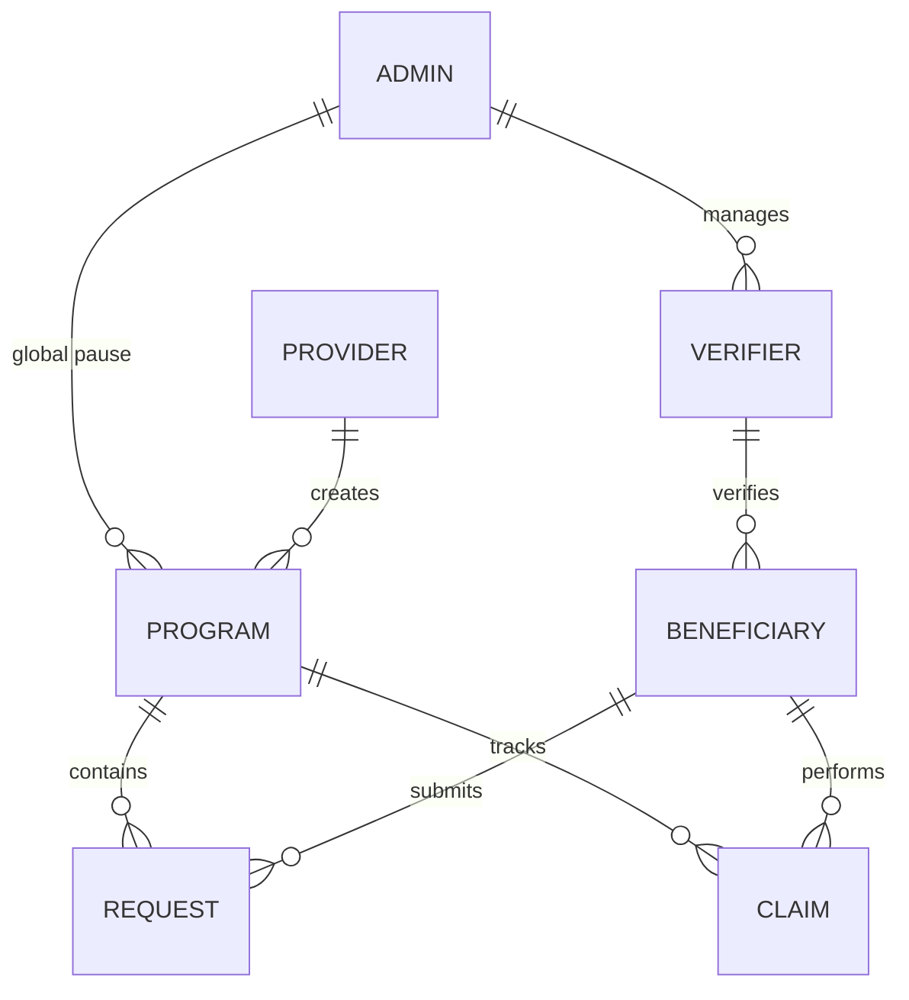

### 📋 Entity Details

| Entity          | Key Fields                                                                                                                                    |
| --------------- | --------------------------------------------------------------------------------------------------------------------------------------------- |
| **ADMIN**       | wallet, canPauseGlobal, canManageVerifiers                                                                                                    |
| **VERIFIER**    | wallet, isActive, addedBy                                                                                                                     |
| **PROVIDER**    | wallet                                                                                                                                        |
| **PROGRAM**     | programId, provider, totalFund, remainingFund, maxPerClaim, mode, status, capPerWallet, startTime, endTime, giftCodeHash, requireVerification |
| **REQUEST**     | requestId, programId, requester, amount, approved, paid                                                                                       |
| **CLAIM**       | programId, claimant, amount, hasClaimed                                                                                                       |
| **BENEFICIARY** | wallet, programId, isVerified                                                                                                                 |

---

## 📅 Alur Kerja Aplikasi (Role-Based Flows)

### 🎨 Keterangan Warna Diagram:

| Warna          | Nama Class   | Arti / Tipe Node  | Contoh Penggunaan                   |
| :------------- | :----------- | :---------------- | :---------------------------------- |
| 🟢 **Hijau**   | `positive`   | Mulai / Berhasil  | Login, Buka Link, Selesai           |
| 🔵 **Biru**    | `actionNode` | Aksi / Proses     | Klik Tombol, Input Data, Submit     |
| 🟡 **Kuning**  | `decision`   | Keputusan / Cek   | Pilihan Menu, Cek Saldo/Role        |
| 🔴 **Merah**   | `danger`     | Bahaya / Berhenti | Program Berakhir, Pause, Dana Habis |
| ⚪ **Abu-abu** | `infoNode`   | Info Tambahan     | Event Kontrak, Label Mode           |

### 1. 🔐 Admin Flow

Admin adalah super-user yang memiliki kontrol global atas sistem.

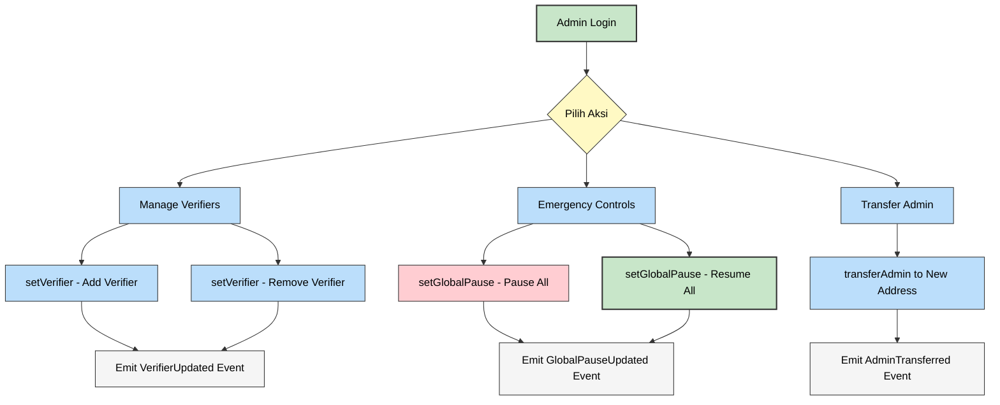

**Fungsi Admin:**
| Function | Description |
|----------|-------------|
| `transferAdmin(newAdmin)` | Transfer admin role ke address baru |
| `setVerifier(verifier, status)` | Tambah/hapus verifier |
| `setGlobalPause(paused)` | Pause/resume seluruh contract (emergency) |

---

### 2. 💼 Provider Flow

Provider adalah penyedia dana yang membuat dan mengelola program distribusi.

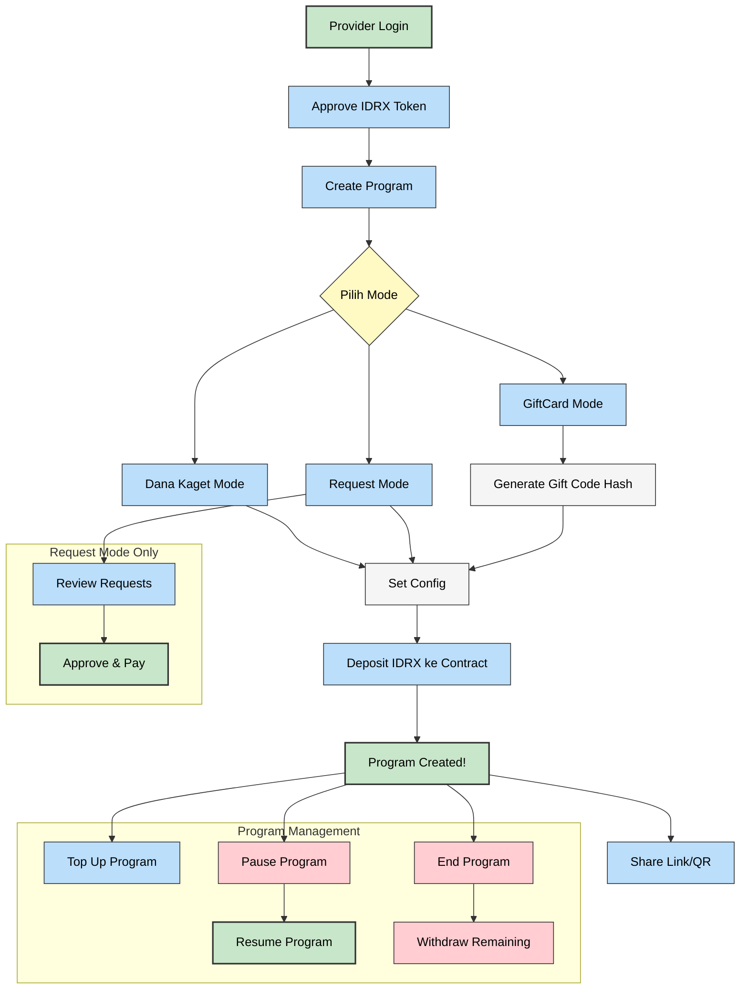

**Fungsi Provider:**
| Function | Description |
|----------|-------------|
| `createProgram(config)` | Buat program baru + deposit dana |
| `topUpProgram(programId, amount)` | Tambah dana ke program |
| `pauseProgram(programId)` | Pause program sementara |
| `resumeProgram(programId)` | Resume program yang di-pause |
| `endProgram(programId)` | Akhiri program permanent |
| `withdrawRemaining(programId)` | Tarik sisa dana (setelah ended) |
| `approveAndPay(programId, requestId)` | Approve dan bayar request |

---

### 3. ✅ Verifier Flow

Verifier bertanggung jawab memverifikasi beneficiary sebelum mereka bisa claim/request.

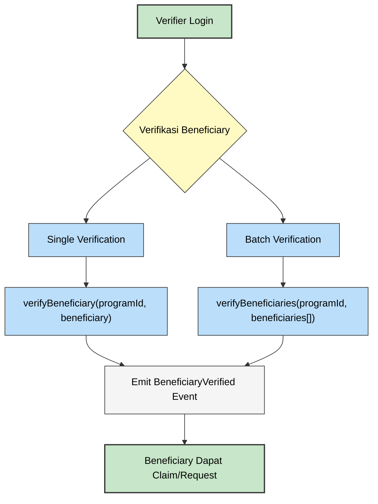

**Fungsi Verifier:**
| Function | Description |
|----------|-------------|
| `verifyBeneficiary(programId, beneficiary)` | Verifikasi single beneficiary |
| `verifyBeneficiaries(programId, beneficiaries[])` | Batch verifikasi |

---

### 4. 🎓 Beneficiary (User) Flow

Beneficiary adalah penerima dana yang melakukan claim atau submit request.

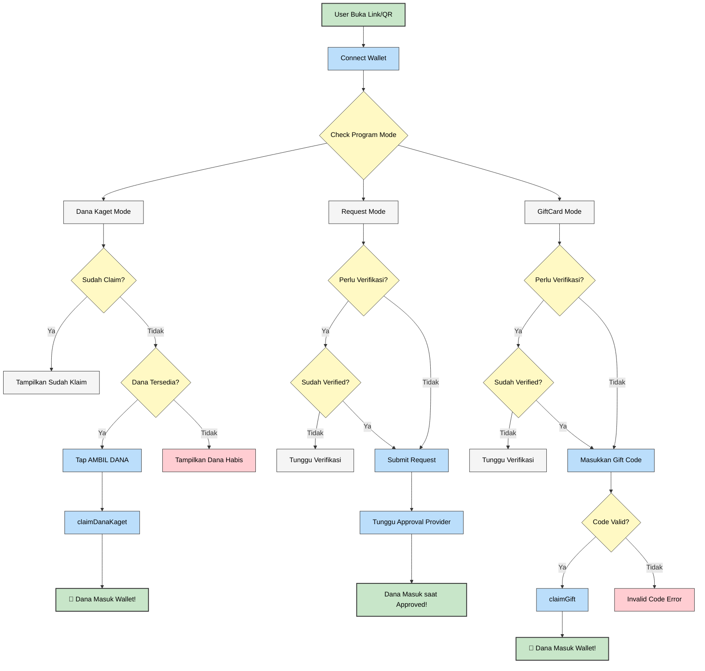

**Fungsi Beneficiary:**
| Function | Description |
|----------|-------------|
| `claimDanaKaget(programId)` | One-tap claim (tanpa verifikasi) |
| `submitRequest(programId, amount)` | Submit request dana |
| `claimGift(programId, code)` | Claim dengan secret code |

---

## 📱 Frontend Application Flow

### Home Page (`/`)

[Home Page](file:///home/sofi-mulyarahman/PocketGrants/frontend/app/page.tsx)

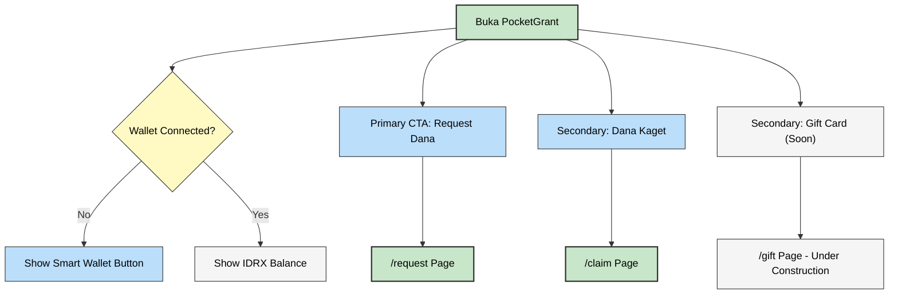

**Fitur Home Page:**

- **Request Dana** - CTA utama untuk mengajukan permohonan bantuan
- **Dana Kaget** - One-tap claim dana gratis
- **Gift Card** - Coming soon (under construction)
- **IDRX Balance** - Tampil jika wallet connected

---

### Request Hub (`/request`)

[Request Hub](file:///home/sofi-mulyarahman/PocketGrants/frontend/app/request/page.tsx)

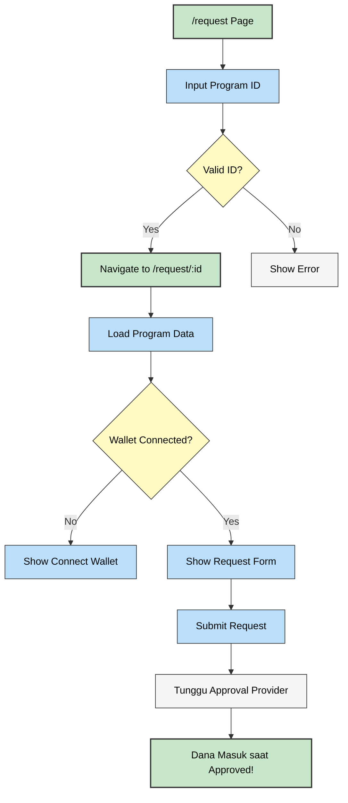

---

### Claim Hub (`/claim`)

[Claim Hub](file:///home/sofi-mulyarahman/PocketGrants/frontend/app/claim/page.tsx)

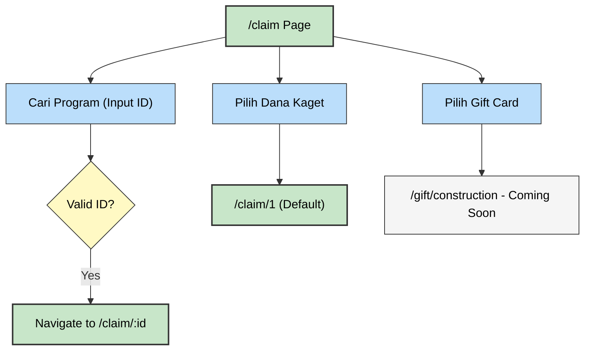

---

### Claim Program Page (`/claim/:id`)

[Claim Page](file:///home/sofi-mulyarahman/PocketGrants/frontend/app/claim/[id]/page.tsx)

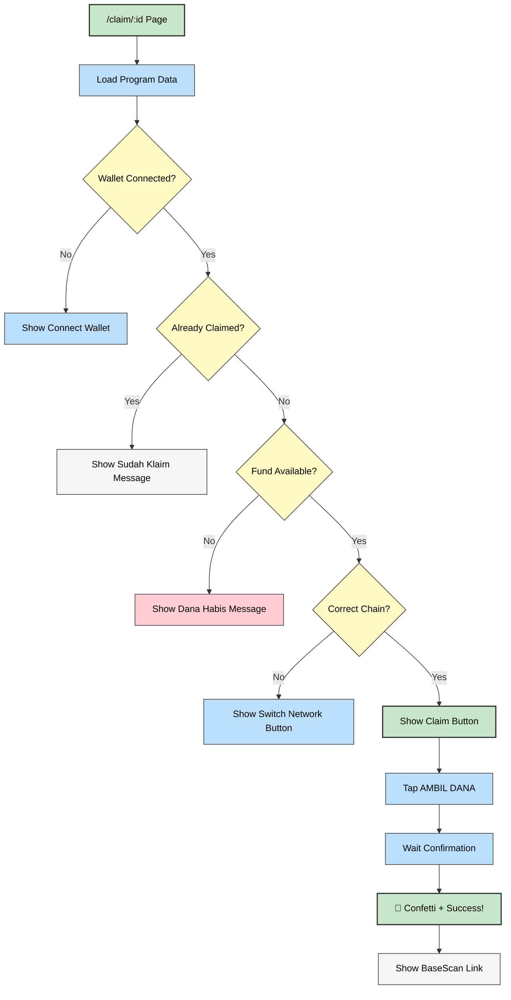

---

### Create Program Page (`/create`)

[Create Page](file:///home/sofi-mulyarahman/PocketGrants/frontend/app/create/page.tsx)

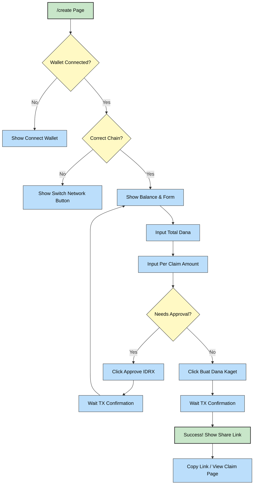

---

## 🔧 Smart Contract Architecture

### Contract Structure

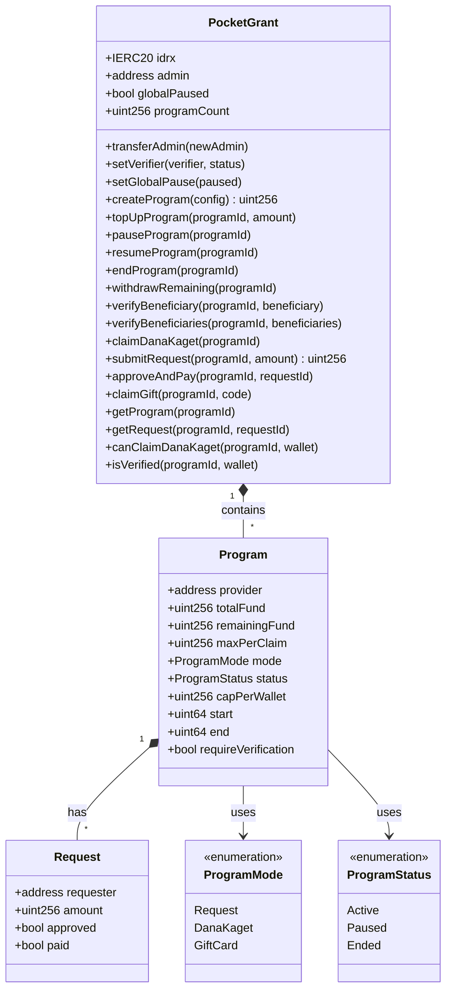

---

## 🔒 Security Features

| Feature                   | Implementation                                        |
| ------------------------- | ----------------------------------------------------- |
| **Reentrancy Protection** | `nonReentrant` modifier pada semua token transfers    |
| **Safe Transfers**        | OpenZeppelin `SafeERC20`                              |
| **CEI Pattern**           | State updated sebelum external calls                  |
| **Custom Errors**         | Gas-efficient error handling                          |
| **Access Control**        | `onlyProvider`, `onlyAdmin`, `onlyVerifier` modifiers |
| **Time Locks**            | `start` dan `end` timestamps untuk program            |
| **Global Pause**          | Emergency stop untuk seluruh contract                 |

---

## 🌐 Tech Stack

### Smart Contract

- **Language**: Solidity ^0.8.20
- **Framework**: Foundry
- **Token**: IDRX (ERC20)
- **Chain**: Base Sepolia (testnet) / Base (mainnet)

### Frontend

- **Framework**: Next.js 14 (App Router)
- **Styling**: Tailwind CSS
- **Web3**: Wagmi + Viem
- **Wallet**: Coinbase Smart Wallet via OnchainKit
  - Passkey/Fingerprint authentication
  - Gasless transactions (with Paymaster)
- **Animations**: Framer Motion
- **UI**: Custom components + Lucide icons

---

## 📄 Contract Deployment Info

| Contract    | Address                                      | Chain        |
| ----------- | -------------------------------------------- | ------------ |
| PocketGrant | `0x486c001d1a07b15613ba57b9eeb5b1333a1383ef` | Base Sepolia |
| IDRX Token  | `0x7cca9d58715511d51c9d270a155df79c8f990586` | Base Sepolia |

---

## 🎬 Demo Flow (2 Minutes)

### Provider Demo

1. **Connect Wallet** - Hubungkan ke Base network dengan saldo IDRX
2. **Buka Create Page** - Akses `/create` dari menu
3. **Input Dana** - Total: 100,000 IDRX, Per Claim: 10,000 IDRX
4. **Approve & Create** - Approve token lalu buat program
5. **Share Link** - Copy link atau generate QR untuk dibagikan

### User Demo

1. **Buka Link** - Scan QR atau klik link dari provider
2. **Connect Wallet** - Gunakan Smart Wallet (Fingerprint)
3. **Tap "AMBIL"** - One-tap claim dana
4. **Cek Balance** - IDRX bertambah instant di wallet
5. **View on BaseScan** - Lihat transaksi untuk transparansi

---

> 💡 **Tip**: Untuk pengalaman gasless, provider dapat mengonfigurasi Paymaster service di environment variable `NEXT_PUBLIC_PAYMASTER_URL`.
