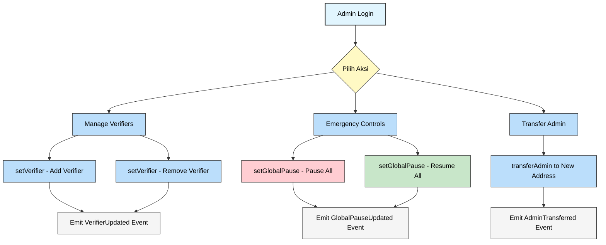
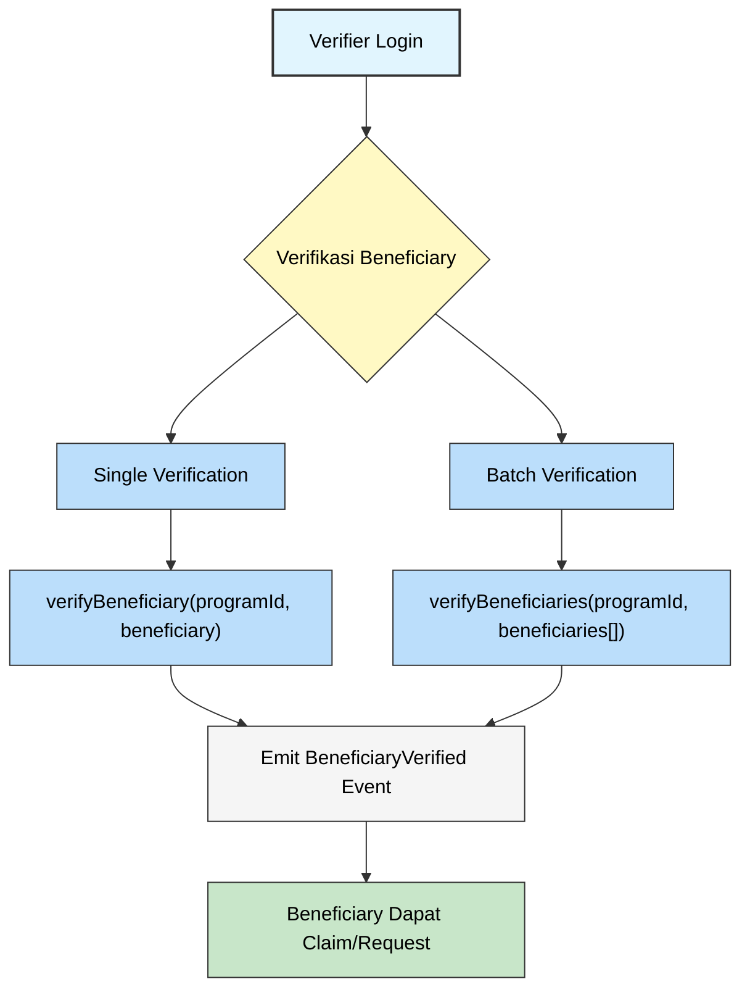
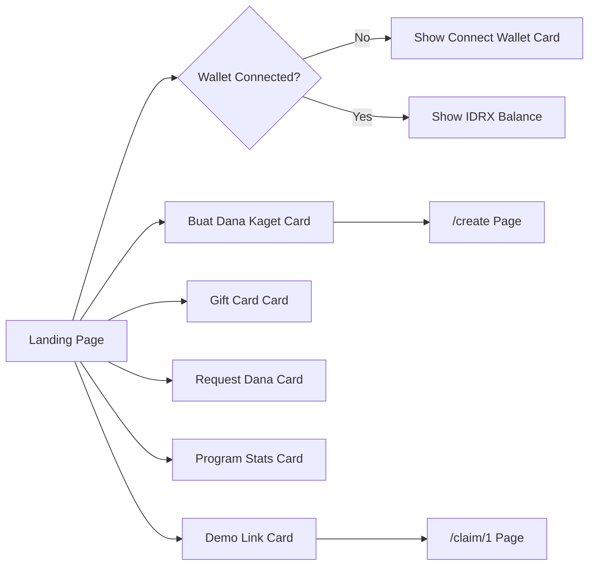
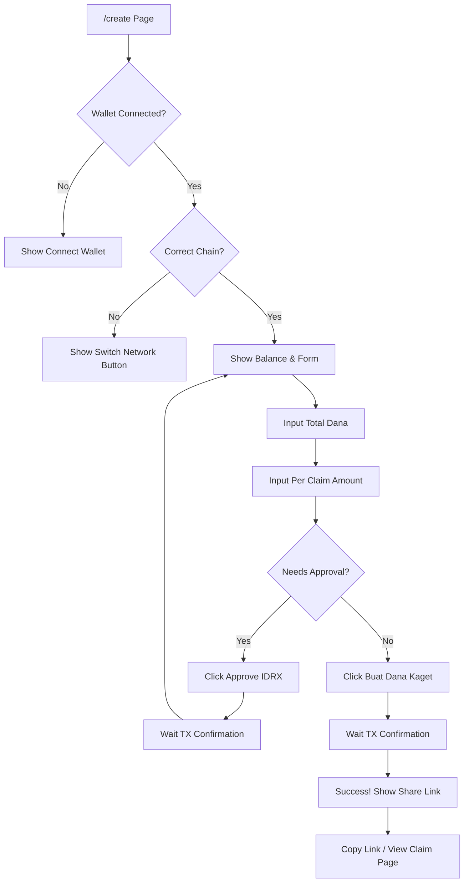

# PocketGrant - Walkthrough Aplikasi 💰

> **Smart Contract Engine for Educational Fund Distribution**
>
> "Satu klik, dana rupiah sampai — cepat, transparan, dan audit-ready."

---

## 📖 Overview Aplikasi

PocketGrant adalah platform distribusi dana pendidikan berbasis blockchain yang dibangun di atas **Base Network** menggunakan token **IDRX**. Aplikasi ini dirancang untuk pengalaman **mobile-first** dengan 3 mode distribusi:

| Mode              | Deskripsi                              | Use Case                      |
| ----------------- | -------------------------------------- | ----------------------------- |
| 🎉 **Dana Kaget** | One-tap claim, first-come-first-served | Viral campaign, hadiah massal |
| 📝 **Request**    | Submit request, provider approves      | Beasiswa terverifikasi        |
| 🎁 **GiftCard**   | Claim dengan secret code               | Share via QR/link privat      |

---

## 🏗️ Entity Relationship Diagram (ERD)

---

## 📅 Alur Kerja Aplikasi (Role-Based Flows)

### 🎨 Keterangan Warna Diagram:

| Warna            | Nama Class   | Arti / Tipe Node  | Contoh Penggunaan                   |
| :--------------- | :----------- | :---------------- | :---------------------------------- |
| 🔵 **Biru**      | `startNode`  | Titik Mulai       | Login, Buka Link                    |
| 🔹 **Biru Muda** | `actionNode` | Aksi / Proses     | Klik Tombol, Input Data, Submit     |
| 🟡 **Kuning**    | `decision`   | Keputusan / Cek   | Pilihan Menu, Cek Saldo/Role        |
| 🟢 **Hijau**     | `success`    | Berhasil / Lanjut | Dana Cair, Transaksi Sukses, Resume |
| 🔴 **Merah**     | `danger`     | Bahaya / Berhenti | Program Berakhir, Pause, Dana Habis |
| ⚪ **Abu-abu**   | `infoNode`   | Info Tambahan     | Event Kontrak, Label Mode           |

### 1. 🔐 Admin Flow

Admin adalah super-user yang memiliki kontrol global atas sistem.

**Fungsi Admin:**
| Function | Description |
|----------|-------------|
| `transferAdmin(newAdmin)` | Transfer admin role ke address baru |
| `setVerifier(verifier, status)` | Tambah/hapus verifier |
| `setGlobalPause(paused)` | Pause/resume seluruh contract (emergency) |

---

### 2. 💼 Provider Flow

Provider adalah penyedia dana yang membuat dan mengelola program distribusi.

**Fungsi Provider:**
| Function | Description |
|----------|-------------|
| `createProgram(config)` | Buat program baru + deposit dana |
| `topUpProgram(programId, amount)` | Tambah dana ke program |
| `pauseProgram(programId)` | Pause program sementara |
| `resumeProgram(programId)` | Resume program yang di-pause |
| `endProgram(programId)` | Akhiri program permanent |
| `withdrawRemaining(programId)` | Tarik sisa dana (setelah ended) |
| `approveAndPay(programId, requestId)` | Approve dan bayar request |

---

### 3. ✅ Verifier Flow

Verifier bertanggung jawab memverifikasi beneficiary sebelum mereka bisa claim/request.

**Fungsi Verifier:**
| Function | Description |
|----------|-------------|
| `verifyBeneficiary(programId, beneficiary)` | Verifikasi single beneficiary |
| `verifyBeneficiaries(programId, beneficiaries[])` | Batch verifikasi |

---

### 4. 🎓 Beneficiary (User) Flow

Beneficiary adalah penerima dana yang melakukan claim atau submit request.

```mermaid
flowchart TD
    classDef startNode stroke:#333,stroke-width:2px,fill:#e1f5fe,color:#000
    classDef actionNode stroke:#333,stroke-width:1px,fill:#bbdefb,color:#000
    classDef decision stroke:#333,stroke-width:1px,fill:#fff9c4,color:#000
    classDef success stroke:#333,stroke-width:1px,fill:#c8e6c9,color:#000
    classDef danger stroke:#333,stroke-width:1px,fill:#ffcdd2,color:#000
    classDef infoNode stroke:#333,stroke-width:1px,fill:#f5f5f5,color:#000

    A["User Buka Link/QR"]:::startNode --> B["Connect Wallet"]:::actionNode
    B --> C{Check Program Mode}:::decision

    C --> D["Dana Kaget Mode"]:::infoNode
    D --> D1{Sudah Claim?}:::decision
    D1 -->|Ya| D2["Tampilkan Sudah Klaim"]:::infoNode
    D1 -->|Tidak| D3{Dana Tersedia?}:::decision
    D3 -->|Ya| D4["Tap AMBIL DANA"]:::actionNode
    D3 -->|Tidak| D5["Tampilkan Dana Habis"]:::danger
    D4 --> D6["claimDanaKaget"]:::actionNode
    D6 --> D7["🎉 Dana Masuk Wallet!"]:::success

    C --> E["Request Mode"]:::infoNode
    E --> E1{Perlu Verifikasi?}:::decision
    E1 -->|Ya| E2{Sudah Verified?}:::decision
    E2 -->|Tidak| E3["Tunggu Verifikasi"]:::infoNode
    E2 -->|Ya| E4["Submit Request"]:::actionNode
    E1 -->|Tidak| E4
    E4 --> E5["Tunggu Approval Provider"]:::actionNode
    E5 --> E6["Dana Masuk saat Approved!"]:::success

    C --> F["GiftCard Mode"]:::infoNode
    F --> F1{Perlu Verifikasi?}:::decision
    F1 -->|Ya| F2{Sudah Verified?}:::decision
    F2 -->|Tidak| F3["Tunggu Verifikasi"]:::infoNode
    F2 -->|Ya| F4["Masukkan Gift Code"]:::actionNode
    F1 -->|Tidak| F4
    F4 --> F5{Code Valid?}:::decision
    F5 -->|Ya| F6["claimGift"]:::actionNode
    F5 -->|Tidak| F7["Invalid Code Error"]:::danger
    F6 --> F8["🎁 Dana Masuk Wallet!"]:::success
```

**Fungsi Beneficiary:**
| Function | Description |
|----------|-------------|
| `claimDanaKaget(programId)` | One-tap claim (tanpa verifikasi) |
| `submitRequest(programId, amount)` | Submit request dana |
| `claimGift(programId, code)` | Claim dengan secret code |

---

## 📱 Frontend Application Flow

### Home Dashboard

[Dashboard Flow](file:///home/sofi-mulyarahman/PocketGrants/frontend/app/page.tsx)

### Create Program Page

[Create Page](file:///home/sofi-mulyarahman/PocketGrants/frontend/app/create/page.tsx)

### Claim Page

[Claim Page](file:///home/sofi-mulyarahman/PocketGrants/frontend/app/claim/[id]/page.tsx)

```mermaid
flowchart TD
    A["/claim/:id Page"] --> B["Load Program Data"]
    B --> C{Loading?}
    C -->|Yes| D["Show Loader"]
    C -->|No| E{Wallet Connected?}

    E -->|No| F["Show Connect Wallet"]
    E -->|Yes| G{Already Claimed?}

    G -->|Yes| H["Show Sudah Klaim Message"]
    G -->|No| I{Fund Available?}

    I -->|No| J["Show Dana Habis Message"]
    I -->|Yes| K{Correct Chain?}

    K -->|No| L["Show Switch Network Button"]
    K -->|Yes| M["Show Claim Button"]

    M --> N["Click AMBIL DANA SEKARANG"]
    N --> O{Paymaster Available?}
    O -->|Yes| P["Gasless Transaction"]
    O -->|No| Q["Normal Transaction"]

    P --> R["Wait Confirmation"]
    Q --> R
    R --> S["🎉 Confetti + Success Message"]
    S --> T["Show BaseScan Link"]
```

---

## 🔧 Smart Contract Architecture

### Contract Structure

---

## 🔒 Security Features

| Feature                   | Implementation                                        |
| ------------------------- | ----------------------------------------------------- |
| **Reentrancy Protection** | `nonReentrant` modifier pada semua token transfers    |
| **Safe Transfers**        | OpenZeppelin `SafeERC20`                              |
| **CEI Pattern**           | State updated sebelum external calls                  |
| **Custom Errors**         | Gas-efficient error handling                          |
| **Access Control**        | `onlyProvider`, `onlyAdmin`, `onlyVerifier` modifiers |
| **Time Locks**            | `start` dan `end` timestamps untuk program            |
| **Global Pause**          | Emergency stop untuk seluruh contract                 |

---

## 🌐 Tech Stack

### Smart Contract

- **Language**: Solidity ^0.8.20
- **Framework**: Foundry
- **Token**: IDRX (ERC20)
- **Chain**: Base Sepolia (testnet) / Base (mainnet)

### Frontend

- **Framework**: Next.js 14 (App Router)
- **Styling**: Tailwind CSS
- **Web3**: Wagmi + Viem
- **Wallet**: Coinbase Smart Wallet (OnchainKit)
- **Animations**: Framer Motion
- **UI**: Radix UI primitives

---

## 📄 Contract Deployment Info

| Contract    | Address                                      | Chain        |
| ----------- | -------------------------------------------- | ------------ |
| PocketGrant | `0x486c001d1a07b15613ba57b9eeb5b1333a1383ef` | Base Sepolia |
| IDRX Token  | `0x7cca9d58715511d51c9d270a155df79c8f990586` | Base Sepolia |

---

## 🎬 Demo Flow (2 Minutes)

### Provider Demo

1. **Connect Wallet** - Hubungkan ke Base network dengan saldo IDRX
2. **Buka Create Page** - Klik "Buat Dana Kaget" dari dashboard
3. **Input Dana** - Total: 100,000 IDRX, Per Claim: 10,000 IDRX
4. **Approve & Create** - Approve token lalu buat program
5. **Share Link** - Copy link atau generate QR untuk dibagikan

### User Demo

1. **Buka Link** - Scan QR atau klik link dari provider
2. **Connect Wallet** - Hubungkan wallet (bisa Smart Wallet)
3. **Tap "AMBIL"** - One-tap claim dana
4. **Cek Balance** - IDRX bertambah instant di wallet
5. **View on BaseScan** - Lihat transaksi untuk transparansi

---

> 💡 **Tip**: Untuk pengalaman gasless, provider dapat mengonfigurasi Paymaster service di environment variable `NEXT_PUBLIC_PAYMASTER_URL`.
